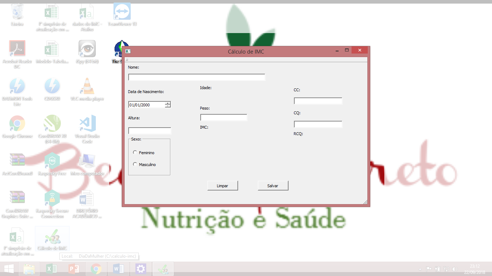

# IMC

## Software simples para calcular o IMC, CC, CQ e RCQ.

Este software foi implementado por mim, para ser utilizado em uma ação social no dia 08 de março de 2018, dia internacional da mulher, por algumas alunas do curso de Nutrição da UNIME, com a intenção de orientar a população sobre seus hábitos alimentares.

